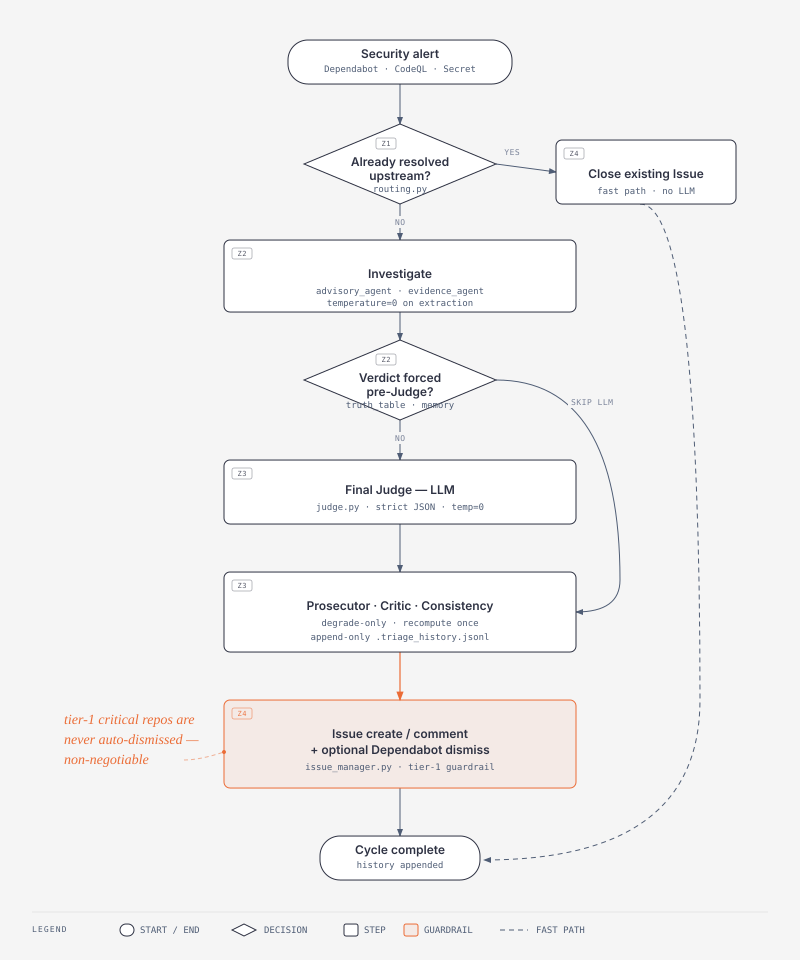
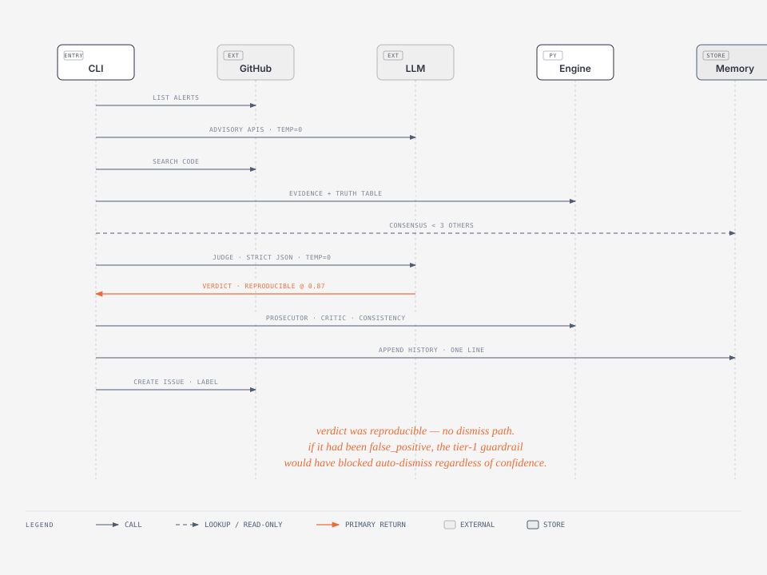

# AppSec Triage Bot

<!-- README-I18N:START -->

**English** | [Español](./README.es.md)

<!-- README-I18N:END -->

Multi-agent defensive triage of Dependabot alerts. Reduces false positives and the team's alert fatigue. GitHub-native. Python 3.11+. Single runtime dependency: `httpx`.

> **Status:** Proof of Concept. v1 consumes Dependabot alerts only. CodeQL and secret scanning are documented [extension hooks](#extending-to-v2) for v2.

## Why this exists

Dependabot is great at finding vulnerable dependencies and noisy at telling you which ones actually affect *your* repository. After a few months you have a backlog of advisories nobody triages, a Slack channel of resolved-to-stale alerts, and the team starts ignoring real findings.

This bot reads Dependabot alerts and answers, per alert: **does this affect us?** It produces a `false_positive` / `reproducible` / `needs_review` verdict with a plain-English conclusion you can read in a GitHub Issue. False positives can be auto-dismissed (configurable, never in tier-1 repos). Reproducibles stay open for the team to fix. `needs_review` means the bot itself isn't sure — humans decide.

<p align="center">
  
</p>

## Quick start

```bash
python3.11 -m venv .venv && source .venv/bin/activate
pip install -e .                 # source of truth: pyproject.toml
cp .env.example .env             # fill LLM_BASE_URL / LLM_API_KEY / LLM_MODEL / GITHUB_TOKEN

# Offline demo: no creds, fixtures only. Pure heuristic flow, no tokens spent.
appsec-triage --offline

# Online dry-run: reads alerts, computes verdicts, mutates nothing.
appsec-triage --repo owner/name --dry-run

# Online with auto-dismiss for high-confidence false positives.
# Tier-1 (critical) repos are NEVER auto-dismissed. Non-negotiable.
appsec-triage --repo owner/name --auto-transition
```

`--offline` and `--repo` are mutually exclusive. `--dry-run` and `--auto-transition` apply to both online and dry runs.

> The console script `appsec-triage` and the legacy `python triage_cycle.py` are interchangeable. The shim exists so the spec wording (`python triage_cycle.py …`) keeps working, but post-install the console script is the idiomatic entry point.

### Dev install

```bash
pip install -e ".[dev]"          # adds pytest + ruff
```

### Required env vars

| Var             | Purpose                                                                                                       |
|-----------------|---------------------------------------------------------------------------------------------------------------|
| `LLM_BASE_URL`  | OpenAI-compatible chat completions endpoint. Defaults to `https://api.openai.com/v1`. Point at your gateway. |
| `LLM_API_KEY`   | Bearer token for the LLM. If missing, Advisory returns `()`, Judge degrades to `needs_review` fallback.       |
| `LLM_MODEL`     | Model id. Defaults to `gpt-4o-mini`. Any model that honors `temperature=0` and `response_format=json_object`. |
| `GITHUB_TOKEN`  | PAT (or App token) with `security_events:write` + `issues:write`.                                            |

All LLM calls use `temperature=0` by contract. Same input → same verdict, by design.

## Architecture — the LLM never acts alone

Every alert passes through deterministic gates on the way in (Truth Table) and on the way out (Prosecutor + Critic + Consistency). The Final Judge is an LLM but it is sandwiched between layers that can override it without involving any model.

```
Z1 routing  →  Z2 investigation (deterministic + LLM-extraction)  →  Z3 judgment  →  Z4 output
```

<p align="center">
  
</p>

<p align="center"><sub><em>An alert traced end to end. The coral arrow is the Judge's verdict — the central decision; everything else is plumbing.</em></sub></p>

### Zone 1 — Routing

Fast-paths without LLM:
- `state in {fixed, dismissed, auto_dismissed}` → close any existing Issue with a one-line note. No Zone 2/3.
- Fetch failure (network, auth) → error note, no Zone 2/3.

### Zone 2 — Investigation (runs before any verdict-producing LLM)

- **Advisory Agent** (LLM, extraction only): pulls dotted symbol names of vulnerable APIs (`requests.Session`, `yaml.load`, …) from the advisory text. No LLM → `()`. The model never decides anything here; the contract is a strict JSON list of names.
- **Evidence Agent** (pure Python): code search reachability (uses of the package and the symbols the Advisory surfaced), repo profile (archived / language / age), manifest / lockfile / Dockerfile presence. Returns an `EvidenceMatrix` of counts and booleans, **no interpretation**.
- **Pre-flight Truth Table** (pure Python): assigns a tier and may **force** a verdict, bypassing the LLM entirely:
  - **Rule A** — `archived AND direct_package_hits == 0` → `false_positive`. The vulnerable code path cannot run in an archived repo with no usage.
  - **Rule B** — `advisory_has_specific_apis AND direct_package_hits == 0 AND (repo_active OR age_days ≥ 180)` → `false_positive`. Absence of evidence treated as evidence, but only when the advisory pinpoints which APIs to look for AND the default branch is representative.
- **Org-wide consensus** (`triage/memory.py`): if the same `CVE+package` has been classified as `false_positive` in ≥ 3 **other** repositories of this org, the bot defaults to that consensus and **skips the Judge**. The current repo never contributes to its own consensus. Confidence is capped at 0.93 — high enough to clear Tier 2/3/4 floors, **below Tier 1's 0.95 floor** so critical repos never auto-FP on hearsay.

### Zone 3 — Judgment

- **Final Judge** (LLM, strict JSON contract, `temperature=0`): returns `{verdict, confidence, human_conclusion}`. `human_conclusion` is plain English, no scores, no agent names, no first-person voice — what the human reading the Issue will see. Three defensive layers protect the contract: system prompt + `response_format={"type":"json_object"}` + a `_parse_response` validator that drops malformed responses and falls back to `needs_review`.
- **Prosecutor** (`triage/prosecutor.py`): adversarial review. Deterministic contradiction checks first (cheap, unhallucinatable), optional LLM attack after if there's nothing concrete to flag. Can request **one** evidence recompute. Only ever **degrades** to `needs_review`; never promotes. Asymmetry intentional: a Prosecutor that could promote would be doing the Judge's job.
- **Critic** (`triage/critic.py`): silent quality gate. If `confidence < tier.post_floor`, degrade to `needs_review`. Never appears in the Issue body. `needs_review` is a failure state by spec, not a comfortable hedge.
- **Consistency Gate** (`triage/consistency.py`): anti flip-flop across runs. Reads `.triage_history.jsonl` and compares with the prior verdict for this `(repo, CVE+package)`:
  - **SKIP** — same verdict as last cycle → no new comment, no re-post.
  - **POST** — verdict flipped AND new confidence ≥ 0.85 → post the override.
  - **GUARD** — verdict flipped AND new confidence < 0.85 → post a "please review before closing" guard message. No auto-action.
  - **FIRST** — no prior history → standard post.

### Zone 4 — Output (GitHub-first, no Jira)

- One Issue per alert. Label `autotriage`. Hidden HTML marker `<!-- triage:CVE::ecosystem::package -->` in the body for state tracking.
- The triage conclusion goes as a comment. The Issue body is created once.
- Auto-transition: when `--auto-transition` is set AND `verdict == false_positive` AND `confidence ≥ tier.transition_floor`, the Dependabot alert is dismissed via `PATCH /repos/{o}/{r}/dependabot/alerts/{n}` with `state=dismissed`. Dismissal reason is `not_used` for Truth Table no-hits rules, `inaccurate` otherwise. **Never** `tolerable_risk` automatically — that is a human policy decision.

## Guardrails (non-negotiable)

- **Tier-1 (critical) repos are NEVER auto-dismissed**, regardless of confidence. Enforced two ways: `TIER_FLOORS[CRITICAL].transition_floor = float("inf")` (the confidence comparison cannot pass) AND an explicit `if tier.tier is Tier.CRITICAL: block` in `_maybe_dismiss`. Belt + suspenders. If anyone edits the floors to a finite value, the early return is the safety net.
- **Never clone repos.** Reachability comes from `/search/code` only.
- **Never write code in target repos.**
- **Never dismiss alerts outside the rules above.** No "tolerable_risk" auto-reason.
- **`temperature=0`** on every LLM call. Same input → same verdict.

## Memory and org-wide consensus

`.triage_history.jsonl` is append-only. One JSON line per alert per cycle:

```json
{"ts":"2026-05-30T12:00:00+00:00","repo":"org/svc","identity":"CVE-2023-32681::pip::requests","alert_number":202,"verdict":"false_positive","confidence":0.92,"source":"judge"}
```

Two consumers:
1. **Consistency Gate** — last entry for `(repo, identity)` defines SKIP/POST/GUARD.
2. **Org-wide consensus** — latest entry per other repo for this `identity`; if ≥ 3 of them are `false_positive`, default to that before invoking the Judge.

In CI the runner is ephemeral and the file does not survive between runs by default. The shipped workflow uploads it as an artifact for audit. For production persist it to S3, a private gist, or a dedicated state repository.

## Modes (recap)

| Command                                                | What it does                                                                          |
|--------------------------------------------------------|---------------------------------------------------------------------------------------|
| `python triage_cycle.py --offline`                     | Bundled fixtures, no network, no LLM. Demonstrates both branches end-to-end.          |
| `python triage_cycle.py --repo owner/name --dry-run`   | Hits GitHub, computes verdicts, **mutates nothing**.                                  |
| `python triage_cycle.py --repo owner/name --auto-transition` | Hits GitHub, posts/closes Issues, dismisses high-confidence FPs (tier-1 still blocked). |

Exit codes: `0` ok · `1` empty input · `2` arg or auth error · `3` fetch error (Z1 error-note path).

## Limitations (PoC)

- **`/search/code` only indexes the default branch and files smaller than 384 KB.** Code on feature branches, in vendored subtrees, or in oversized generated files is invisible to reachability. The Truth Table treats absence-of-hits as evidence only under explicit conditions; the Judge is told about the caveat in its prompt.
- v1 consumes Dependabot alerts only. CodeQL and secret scanning are documented hooks for v2.
- The LLM endpoint must speak the OpenAI chat completions API. Anything that doesn't (raw Anthropic API, Bedrock InvokeModel) needs a thin adapter.
- History persistence in CI is artifact-only. See [Memory](#memory-and-org-wide-consensus).
- Self-feedback is excluded but cross-org coupling is not modeled. If your "org" has subgroups with different risk postures, partition the history file per group.

## Extending to v2

Two extension hooks live just past Zone 1's source resolution. Both are deliberately not wired:

### CodeQL alerts

- Extend `GitHubClient` with `list_code_scanning_alerts(owner, name)` against `/repos/{o}/{r}/code-scanning/alerts`.
- Add an `Alert.from_code_scanning_payload` classmethod that fills the same flat shape (the rest of the pipeline is agnostic).
- Extend the `EvidenceMatrix` to carry CodeQL-specific signals (rule id, location, dataflow class). The Judge prompt grows a section; the Truth Table rules can stay or get CodeQL analogs.
- Reuse Advisory + Judge + Prosecutor + Critic + Consistency unchanged.

### Secret scanning alerts

- Different risk model: there is no "is it reproducible?" question — a leaked secret is leaked.
- **Short-circuit** in Z1 routing: a fresh secret scanning alert → open a "rotate now" Issue with the location of the leak and which secret type, no LLM involvement, no Truth Table, no Prosecutor.
- Consistency Gate still applies (SKIP if the same secret was already reported).
- Auto-transition is permanently off for this source — humans must confirm rotation.

## Project layout

```
appsec-triage/
├── triage_cycle.py              # CLI entry point
├── triage/
│   ├── cli.py                   # argparse + pipeline driver
│   ├── types.py                 # Alert, EvidenceMatrix, Verdict, Tier — frozen dataclasses
│   ├── llm.py                   # OpenAI-compatible client (httpx, temperature=0)
│   ├── github_client.py         # Real + offline backends behind one shape
│   ├── routing.py               # Z1 fast-paths
│   ├── advisory_agent.py        # Z2 LLM extraction of vulnerable API names
│   ├── evidence_agent.py        # Z2 deterministic facts (counts + booleans)
│   ├── truth_table.py           # Z2 tier + forced verdicts (Rules A/B)
│   ├── memory.py                # org-wide consensus reader (≥3 other repos)
│   ├── judge.py                 # Z3 LLM Judge, strict JSON contract
│   ├── prosecutor.py            # Z3 adversarial — deterministic + LLM attack
│   ├── critic.py                # Z3 silent quality gate (tier floor)
│   ├── consistency.py           # Z3 anti flip-flop + history append
│   └── issue_manager.py         # Z4 Issue + Dependabot dismiss + tier-1 guardrail
├── fixtures/alerts/             # offline demo data
├── docs/                        # diagrams (architecture.svg + sequence.svg + HTML versions)
├── .github/workflows/triage.yml # cron + workflow_dispatch
├── pyproject.toml               # package metadata + entry point (source of truth)
├── requirements.txt             # kept for ad-hoc local installs (httpx only)
├── .env.example
├── .gitignore                   # ignores .env, .triage_history.jsonl, .venv, __pycache__
└── .triage_history.jsonl        # append-only memory (gitignored)
```

## License

PoC. Adopt freely. Audit before production.
